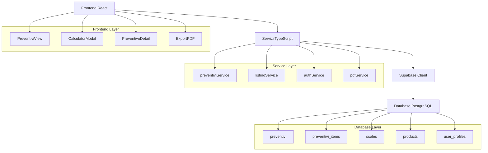

# Architettura Tecnica Sistema Preventivi

## 1. Architettura Generale

### 1.1 Diagramma Architetturale



### 1.2 Stack Tecnologico

- **Frontend**: React 18 + TypeScript + Tailwind CSS
- **Backend**: Supabase (PostgreSQL + Auth + RLS)
- **State Management**: React Query + Context API
- **PDF Generation**: jsPDF / react-pdf
- **Validazione**: Zod
- **Build Tool**: Vite

## 2. Schema Database Dettagliato

### 2.1 Tabella `preventivi`

```sql
CREATE TABLE preventivi (
  -- Identificatori
  id UUID PRIMARY KEY DEFAULT gen_random_uuid(),
  numero_preventivo VARCHAR(50) UNIQUE NOT NULL,
  
  -- Dati cliente
  cliente_nome VARCHAR(255) NOT NULL,
  cliente_email VARCHAR(255),
  cliente_telefono VARCHAR(50),
  cliente_indirizzo TEXT,
  cliente_citta VARCHAR(100),
  cliente_cap VARCHAR(10),
  cliente_provincia VARCHAR(5),
  
  -- Dati preventivo
  data_preventivo DATE NOT NULL,
  data_scadenza DATE,
  validita_giorni INTEGER DEFAULT 30,
  
  -- Relazioni
  agente_id UUID REFERENCES auth.users(id),
  
  -- Stati e controllo
  stato VARCHAR(20) DEFAULT 'bozza' 
    CHECK (stato IN ('bozza', 'inviato', 'accettato', 'rifiutato', 'scaduto')),
  versione INTEGER DEFAULT 1,
  preventivo_padre_id UUID REFERENCES preventivi(id),
  
  -- Calcoli finanziari
  subtotale DECIMAL(12,2) DEFAULT 0,
  sconto_globale_percentuale DECIMAL(5,2) DEFAULT 0,
  sconto_globale_importo DECIMAL(12,2) DEFAULT 0,
  conou_totale DECIMAL(12,2) DEFAULT 0,
  iva_percentuale DECIMAL(5,2) DEFAULT 22.00,
  iva_importo DECIMAL(12,2) DEFAULT 0,
  totale_preventivo DECIMAL(12,2) DEFAULT 0,
  commissioni_totali DECIMAL(12,2) DEFAULT 0,
  margine_totale DECIMAL(12,2) DEFAULT 0,
  
  -- Metadati
  note TEXT,
  condizioni_pagamento TEXT DEFAULT 'Pagamento a 30 giorni data fattura',
  condizioni_consegna TEXT DEFAULT 'Franco nostro magazzino',
  
  -- Audit
  created_at TIMESTAMP WITH TIME ZONE DEFAULT NOW(),
  updated_at TIMESTAMP WITH TIME ZONE DEFAULT NOW(),
  created_by UUID REFERENCES auth.users(id),
  updated_by UUID REFERENCES auth.users(id)
);

-- Trigger per aggiornamento automatico updated_at
CREATE OR REPLACE FUNCTION update_updated_at_column()
RETURNS TRIGGER AS $$
BEGIN
    NEW.updated_at = NOW();
    RETURN NEW;
END;
$$ language 'plpgsql';

CREATE TRIGGER update_preventivi_updated_at 
  BEFORE UPDATE ON preventivi 
  FOR EACH ROW EXECUTE FUNCTION update_updated_at_column();
```

### 2.2 Tabella `preventivi_items`

```sql
CREATE TABLE preventivi_items (
  -- Identificatori
  id UUID PRIMARY KEY DEFAULT gen_random_uuid(),
  preventivo_id UUID REFERENCES preventivi(id) ON DELETE CASCADE,
  
  -- Dati prodotto
  codice_prodotto VARCHAR(50) NOT NULL,
  descrizione TEXT NOT NULL,
  categoria VARCHAR(100),
  plc2 VARCHAR(50),
  
  -- Packaging e unità
  imballo VARCHAR(50),
  quantita_imballo DECIMAL(10,2),
  unita_misura VARCHAR(10) NOT NULL,
  
  -- Quantità e prezzi
  quantita DECIMAL(12,3) NOT NULL,
  prezzo_listino DECIMAL(12,2) NOT NULL,
  sconto_percentuale DECIMAL(5,2) DEFAULT 0,
  prezzo_unitario DECIMAL(12,2) NOT NULL,
  prezzo_scontato DECIMAL(12,2) NOT NULL,
  
  -- Tasse e commissioni
  conou_unitario DECIMAL(10,4) DEFAULT 0,
  conou_totale DECIMAL(12,2) DEFAULT 0,
  commissione_percentuale DECIMAL(5,2) NOT NULL,
  commissione_importo DECIMAL(12,2) NOT NULL,
  
  -- Totali riga
  subtotale_riga DECIMAL(12,2) NOT NULL,
  margine_riga DECIMAL(12,2) DEFAULT 0,
  
  -- Metadati
  note_riga TEXT,
  ordine_visualizzazione INTEGER DEFAULT 0,
  
  -- Audit
  created_at TIMESTAMP WITH TIME ZONE DEFAULT NOW(),
  updated_at TIMESTAMP WITH TIME ZONE DEFAULT NOW()
);

CREATE TRIGGER update_preventivi_items_updated_at 
  BEFORE UPDATE ON preventivi_items 
  FOR EACH ROW EXECUTE FUNCTION update_updated_at_column();
```

### 2.3 Indici per Performance

```sql
-- Indici preventivi
CREATE INDEX idx_preventivi_agente_data ON preventivi(agente_id, data_preventivo DESC);
CREATE INDEX idx_preventivi_stato ON preventivi(stato);
CREATE INDEX idx_preventivi_numero ON preventivi(numero_preventivo);
CREATE INDEX idx_preventivi_cliente ON preventivi(cliente_nome);
CREATE INDEX idx_preventivi_scadenza ON preventivi(data_scadenza) WHERE stato = 'inviato';

-- Indici preventivi_items
CREATE INDEX idx_preventivi_items_preventivo ON preventivi_items(preventivo_id);
CREATE INDEX idx_preventivi_items_prodotto ON preventivi_items(codice_prodotto);
CREATE INDEX idx_preventivi_items_categoria ON preventivi_items(categoria);
CREATE INDEX idx_preventivi_items_ordine ON preventivi_items(preventivo_id, ordine_visualizzazione);
```

### 2.4 Row Level Security (RLS)

```sql
-- Abilitazione RLS
ALTER TABLE preventivi ENABLE ROW LEVEL SECURITY;
ALTER TABLE preventivi_items ENABLE ROW LEVEL SECURITY;

-- Policy preventivi: agenti vedono solo i propri, admin/manager vedono tutto
CREATE POLICY "preventivi_access_policy" ON preventivi
  FOR ALL USING (
    -- L'agente può vedere i suoi preventivi
    agente_id = auth.uid() 
    OR 
    -- Admin e manager vedono tutto
    EXISTS (
      SELECT 1 FROM user_profiles 
      WHERE user_id = auth.uid() 
      AND role IN ('admin', 'manager')
    )
  );

-- Policy preventivi_items: accesso basato sul preventivo
CREATE POLICY "preventivi_items_access_policy" ON preventivi_items
  FOR ALL USING (
    EXISTS (
      SELECT 1 FROM preventivi p 
      WHERE p.id = preventivo_id 
      AND (
        p.agente_id = auth.uid() 
        OR 
        EXISTS (
          SELECT 1 FROM user_profiles 
          WHERE user_id = auth.uid() 
          AND role IN ('admin', 'manager')
        )
      )
    )
  );

-- Policy per inserimento: solo utenti autenticati
CREATE POLICY "preventivi_insert_policy" ON preventivi
  FOR INSERT WITH CHECK (
    auth.uid() IS NOT NULL 
    AND 
    EXISTS (
      SELECT 1 FROM user_profiles 
      WHERE user_id = auth.uid() 
      AND role IN ('admin', 'manager', 'agente')
    )
  );

CREATE POLICY "preventivi_items_insert_policy" ON preventivi_items
  FOR INSERT WITH CHECK (
    EXISTS (
      SELECT 1 FROM preventivi p 
      WHERE p.id = preventivo_id 
      AND (
        p.agente_id = auth.uid() 
        OR 
        EXISTS (
          SELECT 1 FROM user_profiles 
          WHERE user_id = auth.uid() 
          AND role IN ('admin', 'manager')
        )
      )
    )
  );
```

## 3. Servizi e API

### 3.1 Struttura `preventiviService.ts`

```typescript
export interface PreventivoFilters {
  agente_id?: string;
  stato?: string;
  data_da?: string;
  data_a?: string;
  cliente?: string;
  numero?: string;
}

export interface PreventivoStats {
  totale_preventivi: number;
  valore_totale: number;
  preventivi_per_stato: Record<string, number>;
  conversion_rate: number;
  valore_medio: number;
}

class PreventiviService {
  // CRUD Operations
  async createPreventivo(data: PreventivoInsert): Promise<Preventivo>;
  async updatePreventivo(id: string, data: Partial<Preventivo>): Promise<Preventivo>;
  async deletePreventivo(id: string): Promise<void>;
  async getPreventivo(id: string): Promise<Preventivo | null>;
  
  // Query Operations
  async getPreventivi(filters?: PreventivoFilters): Promise<Preventivo[]>;
  async getPreventiviPaginati(page: number, limit: number, filters?: PreventivoFilters): Promise<{
    data: Preventivo[];
    total: number;
    hasMore: boolean;
  }>;
  
  // Items Operations
  async addItemToPreventivo(item: PreventivoItemInsert): Promise<PreventivoItem>;
  async updatePreventivoItem(id: string, data: Partial<PreventivoItem>): Promise<PreventivoItem>;
  async deletePreventivoItem(id: string): Promise<void>;
  async reorderItems(preventivoId: string, itemIds: string[]): Promise<void>;
  
  // Business Logic
  async calcolaTotaliPreventivo(preventivoId: string): Promise<CalcoloPreventivoResult>;
  async aggiornaTotaliPreventivo(preventivoId: string): Promise<void>;
  async duplicaPreventivo(id: string, nuovoNumero: string): Promise<Preventivo>;
  async cambiaStatoPreventivo(id: string, nuovoStato: string): Promise<Preventivo>;
  
  // Statistics
  async getStatistichePreventivi(agenteId?: string): Promise<PreventivoStats>;
  async getTopClienti(limit: number): Promise<Array<{cliente: string, valore: number}>>;
  async getTrendMensili(anno: number): Promise<Array<{mese: number, valore: number}>>;
  
  // Export
  async esportaPreventivoPDF(id: string): Promise<Blob>;
  async esportaPreventiviExcel(filters?: PreventivoFilters): Promise<Blob>;
}
```

### 3.2 Integrazione con `listinoService.ts`

```typescript
// Estensione del listinoService esistente
class ListinoService {
  // ... metodi esistenti ...

  // Nuovo metodo per calcolo riga preventivo
  async calcolaRigaPreventivo(params: {
    codiceProdotto: string;
    quantita: number;
    prezzoUnitario?: number;
    commissionePercentuale?: number;
    scontoPercentuale?: number;
  }): Promise<{
    prezzoListino: number;
    prezzoScontato: number;
    conouUnitario: number;
    conouTotale: number;
    commissioneImporto: number;
    subtotaleRiga: number;
    margineRiga: number;
  }>;

  // Metodo per aggiungere prodotto a preventivo dal calcolatore
  async aggiungiProdottoAPreventivo(
    preventivoId: string,
    calculationResult: CalculationResult
  ): Promise<PreventivoItem>;
}
```

## 4. Componenti Frontend

### 4.1 Architettura Componenti

```
components/preventivi/
├── views/
│   ├── PreventiviView.tsx           // Vista principale
│   ├── PreventivoDetailView.tsx     // Dettaglio singolo preventivo
│   └── PreventiviDashboard.tsx      // Dashboard statistiche
├── forms/
│   ├── PreventivoForm.tsx           // Form creazione/modifica
│   ├── ClienteForm.tsx              // Form dati cliente
│   └── PreventivoItemForm.tsx       // Form riga prodotto
├── lists/
│   ├── PreventivoList.tsx           // Lista preventivi
│   ├── PreventivoItemsList.tsx      // Lista righe preventivo
│   └── PreventivoHistory.tsx        // Storico versioni
├── modals/
│   ├── AddProductModal.tsx          // Modal aggiunta prodotto
│   ├── SelectPreventivoModal.tsx    // Modal selezione preventivo
│   ├── ExportModal.tsx              // Modal opzioni export
│   └── ConfirmDeleteModal.tsx       // Modal conferma eliminazione
├── cards/
│   ├── PreventivoCard.tsx           // Card preventivo in lista
│   ├── PreventivoTotals.tsx         // Card totali
│   └── PreventivoStats.tsx          // Card statistiche
├── common/
│   ├── PreventivoStatusBadge.tsx    // Badge stato
│   ├── PreventivoActions.tsx        // Azioni preventivo
│   └── LoadingSpinner.tsx           // Spinner caricamento
└── hooks/
    ├── usePreventivi.ts             // Hook gestione preventivi
    ├── usePreventivoItems.ts        // Hook gestione items
    └── usePreventivoStats.ts        // Hook statistiche
```

### 4.2 Hook Personalizzati

```typescript
// hooks/usePreventivi.ts
export function usePreventivi(filters?: PreventivoFilters) {
  return useQuery({
    queryKey: ['preventivi', filters],
    queryFn: () => preventiviService.getPreventivi(filters),
    staleTime: 5 * 60 * 1000, // 5 minuti
  });
}

// hooks/usePreventivoItems.ts
export function usePreventivoItems(preventivoId: string) {
  return useQuery({
    queryKey: ['preventivo-items', preventivoId],
    queryFn: () => preventiviService.getPreventivoItems(preventivoId),
    enabled: !!preventivoId,
  });
}

// hooks/usePreventivoMutations.ts
export function usePreventivoMutations() {
  const queryClient = useQueryClient();

  const createMutation = useMutation({
    mutationFn: preventiviService.createPreventivo,
    onSuccess: () => {
      queryClient.invalidateQueries({ queryKey: ['preventivi'] });
    },
  });

  const updateMutation = useMutation({
    mutationFn: ({ id, data }: { id: string; data: Partial<Preventivo> }) =>
      preventiviService.updatePreventivo(id, data),
    onSuccess: () => {
      queryClient.invalidateQueries({ queryKey: ['preventivi'] });
    },
  });

  return { createMutation, updateMutation };
}
```

## 5. Integrazione con Sistema Esistente

### 5.1 Modifica `CalculatorModal.tsx`

```typescript
// Aggiunta pulsante "Aggiungi a Preventivo"
const CalculatorModal = ({ isOpen, onClose, selectedProduct }) => {
  const [showPreventivoModal, setShowPreventivoModal] = useState(false);
  const [calculationResult, setCalculationResult] = useState(null);

  const handleAddToPreventivo = (result: CalculationResult) => {
    setCalculationResult(result);
    setShowPreventivoModal(true);
  };

  return (
    <Modal isOpen={isOpen} onClose={onClose}>
      {/* ... contenuto esistente ... */}
      
      {calculationResult && (
        <div className="mt-4 flex gap-2">
          <button
            onClick={() => handleAddToPreventivo(calculationResult)}
            className="bg-green-600 text-white px-4 py-2 rounded hover:bg-green-700"
          >
            Aggiungi a Preventivo
          </button>
        </div>
      )}

      {showPreventivoModal && (
        <SelectPreventivoModal
          isOpen={showPreventivoModal}
          onClose={() => setShowPreventivoModal(false)}
          calculationResult={calculationResult}
          onAddToPreventivo={handlePreventivoSelection}
        />
      )}
    </Modal>
  );
};
```

### 5.2 Aggiornamento Navigazione

```typescript
// components/RoleBasedNavigation.tsx
const navigationItems = [
  // ... items esistenti ...
  {
    name: 'Preventivi',
    href: '/preventivi',
    icon: DocumentTextIcon,
    roles: ['admin', 'manager', 'agente'],
  },
];
```

### 5.3 Routing

```typescript
// App.tsx
import PreventiviView from './components/preventivi/views/PreventiviView';

function App() {
  return (
    <Routes>
      {/* ... route esistenti ... */}
      <Route 
        path="/preventivi" 
        element={
          <ProtectedRoute allowedRoles={['admin', 'manager', 'agente']}>
            <PreventiviView />
          </ProtectedRoute>
        } 
      />
    </Routes>
  );
}
```

## 6. Performance e Ottimizzazioni

### 6.1 Database Ottimizzazioni

```sql
-- Viste materializzate per statistiche
CREATE MATERIALIZED VIEW preventivi_stats AS
SELECT 
  agente_id,
  COUNT(*) as totale_preventivi,
  SUM(totale_preventivo) as valore_totale,
  AVG(totale_preventivo) as valore_medio,
  COUNT(CASE WHEN stato = 'accettato' THEN 1 END) as preventivi_accettati
FROM preventivi
WHERE data_preventivo >= CURRENT_DATE - INTERVAL '12 months'
GROUP BY agente_id;

-- Refresh automatico ogni ora
CREATE OR REPLACE FUNCTION refresh_preventivi_stats()
RETURNS void AS $$
BEGIN
  REFRESH MATERIALIZED VIEW preventivi_stats;
END;
$$ LANGUAGE plpgsql;

-- Scheduled job per refresh
SELECT cron.schedule('refresh-preventivi-stats', '0 * * * *', 'SELECT refresh_preventivi_stats();');
```

### 6.2 Frontend Ottimizzazioni

```typescript
// Lazy loading componenti pesanti
const PreventivoDetailView = lazy(() => import('./views/PreventivoDetailView'));
const ExportModal = lazy(() => import('./modals/ExportModal'));

// Memoizzazione calcoli pesanti
const PreventivoTotals = memo(({ items }: { items: PreventivoItem[] }) => {
  const totals = useMemo(() => {
    return calculateTotals(items);
  }, [items]);

  return <div>{/* render totals */}</div>;
});

// Virtualizzazione liste lunghe
import { FixedSizeList as List } from 'react-window';

const PreventivoItemsList = ({ items }: { items: PreventivoItem[] }) => {
  return (
    <List
      height={400}
      itemCount={items.length}
      itemSize={60}
      itemData={items}
    >
      {PreventivoItemRow}
    </List>
  );
};
```

## 7. Testing Strategy

### 7.1 Unit Tests

```typescript
// __tests__/services/preventiviService.test.ts
describe('PreventiviService', () => {
  test('should create preventivo with correct totals', async () => {
    const preventivo = await preventiviService.createPreventivo(mockData);
    expect(preventivo.totale_preventivo).toBe(expectedTotal);
  });

  test('should calculate totals correctly', async () => {
    const totals = await preventiviService.calcolaTotaliPreventivo(preventivoId);
    expect(totals.subtotale).toBe(expectedSubtotal);
  });
});
```

### 7.2 Integration Tests

```typescript
// __tests__/integration/preventivi.test.ts
describe('Preventivi Integration', () => {
  test('should create preventivo and add items', async () => {
    // Test completo del flusso
  });

  test('should respect RLS policies', async () => {
    // Test sicurezza accesso dati
  });
});
```

### 7.3 E2E Tests

```typescript
// cypress/e2e/preventivi.cy.ts
describe('Preventivi E2E', () => {
  it('should create and manage preventivo', () => {
    cy.login('agente@test.com');
    cy.visit('/preventivi');
    cy.get('[data-testid="new-preventivo"]').click();
    // ... test completo UI
  });
});
```

Questa architettura fornisce una base solida e scalabile per l'integrazione del sistema preventivi, mantenendo la compatibilità con l'esistente e aggiungendo funzionalità avanzate per la gestione aziendale.