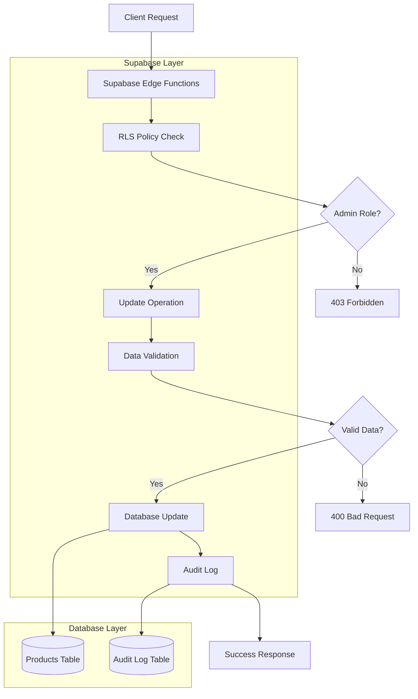
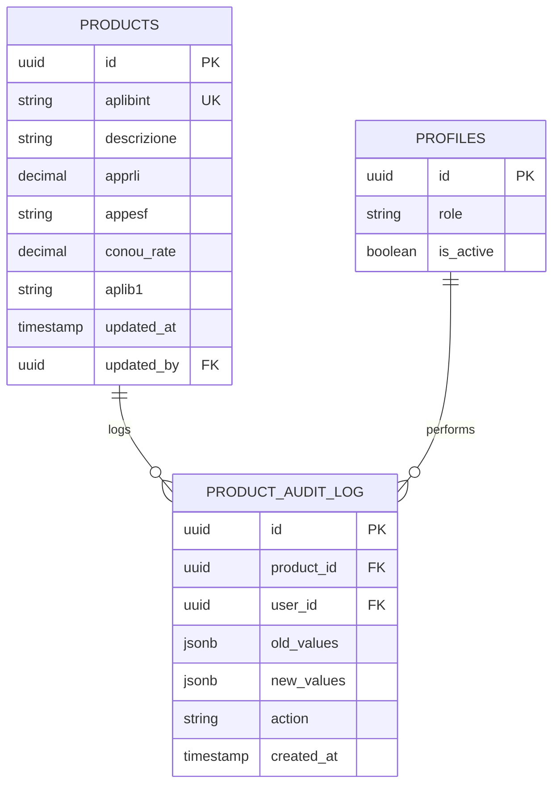

# Architettura Tecnica - Modifica Prodotti Listino

## 1. Architecture Design

```mermaid
graph TD
    A[Admin Browser] --> B[React ProductTable Component]
    B --> C[AuthContext - isAdmin()]
    B --> D[ProductEditService]
    D --> E[Supabase Client SDK]
    E --> F[Supabase Database]
    
    subgraph "Frontend Layer"
        B
        C
        G[EditableProductRow Component]
        H[ProductEditModal Component - Mobile]
    end
    
    subgraph "Service Layer"
        D
        I[ValidationService]
        J[NotificationService]
    end
    
    subgraph "Data Layer"
        F
        K[RLS Policies]
    end
    
    B --> G
    B --> H
    D --> I
    D --> J
    E --> K
```

## 2. Technology Description

- **Frontend**: React@18 + TypeScript + TailwindCSS@3 + Vite
- **Backend**: Supabase (PostgreSQL + RLS)
- **Authentication**: Supabase Auth + AuthContext
- **Validation**: Zod per validazione TypeScript
- **Notifications**: React-hot-toast per feedback utente
- **Icons**: Lucide React

## 3. Route Definitions

| Route | Purpose | Modifiche |
|-------|---------|-----------|
| /listino | Listino Prodotti con funzionalità modifica | Aggiunta componenti di modifica inline |

## 4. API Definitions

### 4.1 Core API

**Aggiornamento prodotto**
```
PUT /rest/v1/products
```

Request:
| Param Name | Param Type | isRequired | Description |
|------------|------------|------------|-------------|
| id | string | true | ID del prodotto da modificare |
| descrizione | string | false | Nuova descrizione |
| apprli | number | false | Nuovo prezzo |
| appesf | string | false | Nuovo valore APPESF |
| conou_rate | number | false | Nuovo valore CONOU |
| aplib1 | string | false | Nuovo valore APLIB1 |

Response:
| Param Name | Param Type | Description |
|------------|------------|-------------|
| success | boolean | Stato dell'operazione |
| data | Product | Prodotto aggiornato |
| error | string | Messaggio di errore (se presente) |

Example Request:
```json
{
  "id": "123e4567-e89b-12d3-a456-426614174000",
  "descrizione": "Olio motore sintetico 5W-30",
  "apprli": 45.50,
  "appesf": "SINT",
  "conou_rate": 0.00365,
  "aplib1": "PREMIUM"
}
```

Example Response:
```json
{
  "success": true,
  "data": {
    "id": "123e4567-e89b-12d3-a456-426614174000",
    "aplibint": "ROL001",
    "descrizione": "Olio motore sintetico 5W-30",
    "apprli": 45.50,
    "appesf": "SINT",
    "conou_rate": 0.00365,
    "aplib1": "PREMIUM",
    "updated_at": "2024-01-15T10:30:00Z"
  }
}
```

## 5. Server Architecture Diagram



## 6. Data Model

### 6.1 Data Model Definition



### 6.2 Data Definition Language

**Tabella Audit Log per Prodotti**
```sql
-- Crea tabella audit log
CREATE TABLE IF NOT EXISTS product_audit_log (
    id UUID PRIMARY KEY DEFAULT gen_random_uuid(),
    product_id UUID NOT NULL REFERENCES products(id) ON DELETE CASCADE,
    user_id UUID NOT NULL REFERENCES profiles(id),
    old_values JSONB,
    new_values JSONB,
    action VARCHAR(20) NOT NULL CHECK (action IN ('UPDATE', 'DELETE')),
    created_at TIMESTAMP WITH TIME ZONE DEFAULT NOW()
);

-- Indici per performance
CREATE INDEX idx_product_audit_log_product_id ON product_audit_log(product_id);
CREATE INDEX idx_product_audit_log_user_id ON product_audit_log(user_id);
CREATE INDEX idx_product_audit_log_created_at ON product_audit_log(created_at DESC);

-- RLS Policy per audit log (solo admin possono leggere)
ALTER TABLE product_audit_log ENABLE ROW LEVEL SECURITY;

CREATE POLICY "Admin can view audit log" ON product_audit_log
    FOR SELECT USING (
        EXISTS (
            SELECT 1 FROM profiles 
            WHERE profiles.id = auth.uid() 
            AND profiles.role = 'admin' 
            AND profiles.is_active = true
        )
    );

-- Policy per inserimento automatico audit log
CREATE POLICY "System can insert audit log" ON product_audit_log
    FOR INSERT WITH CHECK (true);

-- Trigger per audit automatico
CREATE OR REPLACE FUNCTION log_product_changes()
RETURNS TRIGGER AS $$
BEGIN
    IF TG_OP = 'UPDATE' THEN
        INSERT INTO product_audit_log (product_id, user_id, old_values, new_values, action)
        VALUES (
            NEW.id,
            auth.uid(),
            to_jsonb(OLD),
            to_jsonb(NEW),
            'UPDATE'
        );
        RETURN NEW;
    ELSIF TG_OP = 'DELETE' THEN
        INSERT INTO product_audit_log (product_id, user_id, old_values, new_values, action)
        VALUES (
            OLD.id,
            auth.uid(),
            to_jsonb(OLD),
            NULL,
            'DELETE'
        );
        RETURN OLD;
    END IF;
    RETURN NULL;
END;
$$ LANGUAGE plpgsql SECURITY DEFINER;

CREATE TRIGGER product_audit_trigger
    AFTER UPDATE OR DELETE ON products
    FOR EACH ROW EXECUTE FUNCTION log_product_changes();
```

**Policy RLS per modifica prodotti**
```sql
-- Policy per aggiornamento prodotti (solo admin)
CREATE POLICY "Admin can update products" ON products
    FOR UPDATE USING (
        EXISTS (
            SELECT 1 FROM profiles 
            WHERE profiles.id = auth.uid() 
            AND profiles.role = 'admin' 
            AND profiles.is_active = true
        )
    );

-- Aggiorna colonna updated_by automaticamente
ALTER TABLE products ADD COLUMN IF NOT EXISTS updated_by UUID REFERENCES profiles(id);
ALTER TABLE products ADD COLUMN IF NOT EXISTS updated_at TIMESTAMP WITH TIME ZONE DEFAULT NOW();

CREATE OR REPLACE FUNCTION update_product_metadata()
RETURNS TRIGGER AS $$
BEGIN
    NEW.updated_at = NOW();
    NEW.updated_by = auth.uid();
    RETURN NEW;
END;
$$ LANGUAGE plpgsql;

CREATE TRIGGER update_product_metadata_trigger
    BEFORE UPDATE ON products
    FOR EACH ROW EXECUTE FUNCTION update_product_metadata();
```

## 7. Component Architecture

### 7.1 Struttura Componenti

```
components/
├── listino/
│   ├── ProductTable.tsx (modificato)
│   ├── EditableProductRow.tsx (nuovo)
│   ├── ProductEditModal.tsx (nuovo - mobile)
│   └── ProductEditButton.tsx (nuovo)
├── ui/
│   ├── EditableField.tsx (nuovo)
│   └── ValidationMessage.tsx (nuovo)
└── hooks/
    ├── useProductEdit.tsx (nuovo)
    └── useAdminCheck.tsx (nuovo)
```

### 7.2 Services

```
services/
├── productEditService.ts (nuovo)
├── validationService.ts (nuovo)
└── auditService.ts (nuovo)
```

## 8. TypeScript Interfaces

### 8.1 Core Types

```typescript
// Tipi per modifica prodotti
interface EditableProduct {
  id: string;
  descrizione?: string;
  apprli?: number;
  appesf?: string;
  conou_rate?: number;
  aplib1?: string;
}

interface ProductEditState {
  isEditing: boolean;
  editingProductId: string | null;
  editedValues: Partial<EditableProduct>;
  validationErrors: Record<string, string>;
  isLoading: boolean;
}

interface ProductEditResponse {
  success: boolean;
  data?: Product;
  error?: string;
  validationErrors?: Record<string, string>;
}

// Audit Log
interface ProductAuditLog {
  id: string;
  product_id: string;
  user_id: string;
  old_values: Record<string, any>;
  new_values: Record<string, any>;
  action: 'UPDATE' | 'DELETE';
  created_at: string;
}
```

### 8.2 Validation Schema

```typescript
import { z } from 'zod';

export const ProductEditSchema = z.object({
  descrizione: z.string()
    .min(1, 'Descrizione obbligatoria')
    .max(255, 'Descrizione troppo lunga')
    .optional(),
  
  apprli: z.number()
    .positive('Il prezzo deve essere positivo')
    .max(99999.99, 'Prezzo troppo alto')
    .optional(),
  
  appesf: z.string()
    .max(50, 'APPESF troppo lungo')
    .optional(),
  
  conou_rate: z.number()
    .min(0, 'CONOU non può essere negativo')
    .max(1, 'CONOU non può essere superiore a 1')
    .optional(),
  
  aplib1: z.string()
    .max(100, 'APLIB1 troppo lungo')
    .optional()
});
```

## 9. Performance Considerations

### 9.1 Ottimizzazioni

- **Debounced validation**: Validazione con ritardo per evitare chiamate eccessive
- **Optimistic updates**: Aggiornamento UI immediato con rollback in caso di errore
- **Batch operations**: Possibilità di modificare più prodotti contemporaneamente
- **Caching**: Cache locale delle modifiche per evitare perdite di dati

### 9.2 Monitoring

- Log delle operazioni di modifica per audit
- Metriche di performance per operazioni di update
- Tracking errori di validazione per miglioramenti UX