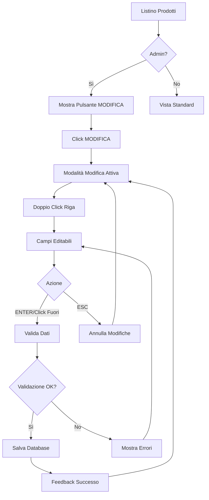

# Funzionalità Modifica Prodotti - Listino Prodotti

## 1. Product Overview

Sistema di modifica inline per i prodotti del listino, riservato esclusivamente agli amministratori del sistema. La funzionalità permette di modificare rapidamente i dati dei prodotti direttamente dalla tabella principale senza dover aprire modali o pagine separate.

- **Problema risolto**: Necessità di modificare rapidamente i dati dei prodotti senza interruzioni del flusso di lavoro
- **Utenti target**: Amministratori del sistema GAR (Gestione Agenti Roloil)
- **Valore**: Miglioramento dell'efficienza operativa e riduzione dei tempi di aggiornamento del listino

## 2. Core Features

### 2.1 User Roles

| Ruolo | Metodo di Accesso | Permessi Core |
|-------|-------------------|---------------|
| Admin | Autenticazione esistente + ruolo admin | Può visualizzare e utilizzare il pulsante MODIFICA, può modificare tutti i campi del prodotto |
| Agente/Operatore | Autenticazione esistente | Visualizzazione normale del listino senza funzioni di modifica |

### 2.2 Feature Module

La funzionalità di modifica prodotti si integra nella pagina esistente del Listino Prodotti:

1. **Listino Prodotti (esistente)**: aggiunta pulsante MODIFICA, modalità modifica inline, validazione e salvataggio

### 2.3 Page Details

| Page Name | Module Name | Feature description |
|-----------|-------------|---------------------|
| Listino Prodotti | Pulsante MODIFICA | Visualizza pulsante "MODIFICA" solo per gli admin, attiva/disattiva modalità modifica globale |
| Listino Prodotti | Modifica Inline | Doppio click su riga prodotto attiva modifica inline dei campi, ESC annulla, ENTER salva |
| Listino Prodotti | Validazione Dati | Valida formato prezzo, CONOU, lunghezza descrizione prima del salvataggio |
| Listino Prodotti | Feedback Visivo | Mostra indicatori di caricamento, successo/errore, campi modificati evidenziati |
| Listino Prodotti | Gestione Errori | Gestisce errori di rete, validazione, permessi con messaggi informativi |

## 3. Core Process

### Flusso Admin - Modifica Prodotto

1. **Accesso**: Admin accede al Listino Prodotti
2. **Attivazione**: Admin clicca pulsante "MODIFICA" per attivare modalità modifica
3. **Selezione**: Admin fa doppio click su una riga prodotto
4. **Modifica**: I campi modificabili diventano input editabili
5. **Salvataggio**: Admin preme ENTER o clicca fuori per salvare, ESC per annullare
6. **Conferma**: Sistema mostra feedback di successo/errore
7. **Aggiornamento**: Tabella si aggiorna con i nuovi valori

## 4. User Interface Design

### 4.1 Design Style

- **Colori primari**: Blu (#3B82F6) per pulsante MODIFICA, Verde (#10B981) per successo
- **Colori secondari**: Rosso (#EF4444) per errori, Giallo (#F59E0B) per warning
- **Stile pulsanti**: Arrotondati con ombra leggera, hover effect
- **Font**: Sistema esistente (Inter/system fonts), dimensioni 14px per campi editabili
- **Layout**: Integrato nella tabella esistente, overlay per feedback
- **Icone**: Lucide React (Edit, Save, X, Check)

### 4.2 Page Design Overview

| Page Name | Module Name | UI Elements |
|-----------|-------------|-------------|
| Listino Prodotti | Pulsante MODIFICA | Pulsante blu con icona Edit, posizionato in alto a destra della tabella, visibile solo ad admin |
| Listino Prodotti | Riga in Modifica | Bordo blu evidenziato, campi input con sfondo bianco, icone save/cancel inline |
| Listino Prodotti | Feedback Visivo | Toast notifications per successo/errore, spinner di caricamento, campi evidenziati |
| Listino Prodotti | Validazione | Bordi rossi per errori, tooltip con messaggi di errore, indicatori di campo obbligatorio |

### 4.3 Responsiveness

- **Desktop-first**: Funzionalità ottimizzata per desktop con tabella completa
- **Mobile-adaptive**: Su mobile, modifica tramite modal overlay per migliore usabilità
- **Touch optimization**: Doppio tap su mobile, gesture swipe per annullare

## 5. Campi Modificabili

### 5.1 Campi Editabili

| Campo | Tipo | Validazione | Formato |
|-------|------|-------------|---------|
| Descrizione | Text | Max 255 caratteri, non vuoto | String |
| Prezzo (APPRLI) | Number | > 0, max 2 decimali | €XX.XX |
| APPESF | Text | Max 50 caratteri | String |
| CONOU | Number | >= 0, max 5 decimali | 0.XXXXX |
| APLIB1 | Text | Max 100 caratteri | String |

### 5.2 Campi Non Modificabili

- APLIBINT (chiave primaria)
- BRAND (gestito separatamente)
- XDE40/XDE60 (calcolati)
- APDESI (categoria fissa)
- APUNMI (unità di misura fissa)
- Colonne virtuali (MINIMO AGENTE, MINIMA PROVV., etc.)

## 6. Sicurezza e Permessi

### 6.1 Controllo Accessi

- Verifica ruolo admin tramite `AuthContext.isAdmin()`
- Validazione lato server per ogni operazione di modifica
- Log delle modifiche per audit trail

### 6.2 Validazione Dati

- Validazione client-side per feedback immediato
- Validazione server-side per sicurezza
- Sanitizzazione input per prevenire XSS/injection

## 7. Gestione Errori

### 7.1 Tipi di Errore

- **Permessi**: Utente non autorizzato
- **Validazione**: Dati non conformi ai requisiti
- **Rete**: Problemi di connessione
- **Database**: Errori di salvataggio

### 7.2 Feedback Utente

- Toast notifications per errori/successi
- Indicatori visivi sui campi con errori
- Messaggi informativi chiari e actionable