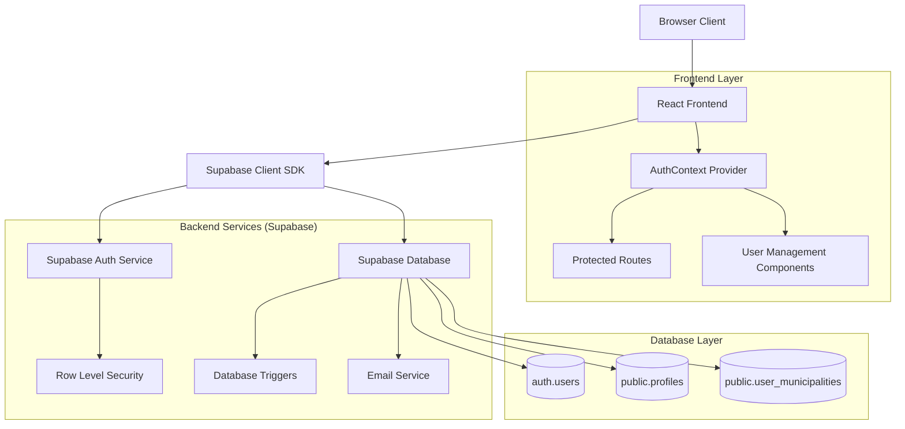
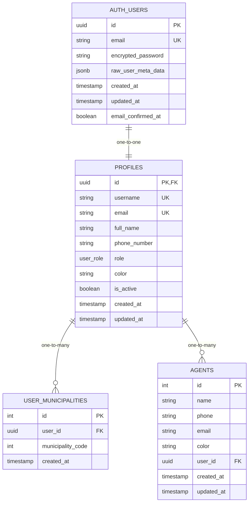

# 🏗️ Architettura Tecnica - Sistema di Autenticazione

## 1. Architettura del Sistema



## 2. Stack Tecnologico

* **Frontend**: React\@18 + TypeScript + Vite + TailwindCSS\@3

* **Backend**: Supabase (PostgreSQL + Auth + Real-time)

* **State Management**: React Context + Custom Hooks

* **Validazione**: Zod + React Hook Form

* **UI Components**: Headless UI + Heroicons

* **Styling**: TailwindCSS con configurazione custom

## 3. Definizione delle Route

| Route                | Scopo                                | Protezione           |
| -------------------- | ------------------------------------ | -------------------- |
| `/`                  | Homepage con redirect basato su auth | Pubblica             |
| `/login`             | Pagina di login                      | Solo non autenticati |
| `/register`          | Registrazione pubblica               | Solo non autenticati |
| `/dashboard`         | Dashboard principale                 | Autenticati          |
| `/profile`           | Gestione profilo utente              | Autenticati          |
| `/admin/users`       | Gestione utenti (solo admin)         | Solo admin           |
| `/admin/permissions` | Gestione permessi                    | Solo admin           |
| `/territories`       | Gestione territori                   | Agenti e admin       |

## 4. API e Servizi

### 4.1 Servizio di Autenticazione

```typescript
// AuthService - Gestione completa autenticazione
interface AuthService {
  // Registrazione pubblica
  signUp(data: SignUpData): Promise<AuthResponse>
  
  // Login
  signIn(email: string, password: string): Promise<AuthResponse>
  
  // Logout
  signOut(): Promise<void>
  
  // Creazione utente da admin
  createUserByAdmin(data: AdminCreateUserData): Promise<AuthResponse>
  
  // Gestione profilo
  updateProfile(data: ProfileUpdateData): Promise<ProfileResponse>
  
  // Recupero password
  resetPassword(email: string): Promise<void>
  
  // Cambio password
  changePassword(newPassword: string): Promise<void>
}
```

### 4.2 API per Gestione Utenti

```typescript
// UserManagementService - Gestione utenti per admin
interface UserManagementService {
  // Lista utenti con filtri
  getUsers(filters?: UserFilters): Promise<User[]>
  
  // Dettagli utente
  getUserById(id: string): Promise<User>
  
  // Aggiornamento ruolo
  updateUserRole(userId: string, role: UserRole): Promise<void>
  
  // Attivazione/disattivazione
  toggleUserStatus(userId: string, isActive: boolean): Promise<void>
  
  // Eliminazione utente
  deleteUser(userId: string): Promise<void>
  
  // Assegnazione territori
  assignTerritories(userId: string, territories: string[]): Promise<void>
}
```

### 4.3 Tipi TypeScript Condivisi

```typescript
// Tipi per autenticazione
interface SignUpData {
  email: string
  password: string
  username: string
  full_name: string
  phone_number?: string
  role: 'agente' | 'operatore'
}

interface AdminCreateUserData extends SignUpData {
  role: 'admin' | 'agente' | 'operatore'
  is_active: boolean
  territories?: string[]
}

interface User {
  id: string
  email: string
  username: string
  full_name: string
  phone_number?: string
  role: UserRole
  color: string
  is_active: boolean
  created_at: string
  updated_at: string
  territories?: Territory[]
}

type UserRole = 'admin' | 'agente' | 'operatore'

interface AuthResponse {
  user: User | null
  error: AuthError | null
}
```

## 5. Architettura Database

### 5.1 Schema del Database



### 5.2 DDL (Data Definition Language)

```sql
-- Creazione enum per ruoli utente
CREATE TYPE user_role AS ENUM ('admin', 'agente', 'operatore');

-- Tabella profili utente
CREATE TABLE public.profiles (
    id UUID PRIMARY KEY REFERENCES auth.users(id) ON DELETE CASCADE,
    username TEXT UNIQUE NOT NULL,
    email TEXT UNIQUE NOT NULL,
    full_name TEXT NOT NULL,
    phone_number TEXT,
    role user_role NOT NULL DEFAULT 'operatore',
    color TEXT NOT NULL DEFAULT '#6B7280',
    is_active BOOLEAN NOT NULL DEFAULT true,
    created_at TIMESTAMPTZ DEFAULT NOW(),
    updated_at TIMESTAMPTZ DEFAULT NOW()
);

-- Tabella associazione utenti-comuni
CREATE TABLE public.user_municipalities (
    id SERIAL PRIMARY KEY,
    user_id UUID NOT NULL REFERENCES public.profiles(id) ON DELETE CASCADE,
    municipality_code INTEGER NOT NULL,
    created_at TIMESTAMPTZ DEFAULT NOW()
);

-- Indici per performance
CREATE INDEX idx_profiles_email ON public.profiles(email);
CREATE INDEX idx_profiles_username ON public.profiles(username);
CREATE INDEX idx_profiles_role ON public.profiles(role);
CREATE INDEX idx_profiles_is_active ON public.profiles(is_active);
CREATE INDEX idx_user_municipalities_user_id ON public.user_municipalities(user_id);
CREATE INDEX idx_user_municipalities_code ON public.user_municipalities(municipality_code);

-- Trigger per aggiornamento automatico timestamp
CREATE OR REPLACE FUNCTION update_updated_at_column()
RETURNS TRIGGER AS $$
BEGIN
    NEW.updated_at = NOW();
    RETURN NEW;
END;
$$ language 'plpgsql';

CREATE TRIGGER update_profiles_updated_at 
    BEFORE UPDATE ON public.profiles 
    FOR EACH ROW EXECUTE FUNCTION update_updated_at_column();

-- Funzione per creazione automatica profilo
CREATE OR REPLACE FUNCTION public.handle_new_user()
RETURNS TRIGGER AS $$
BEGIN
    INSERT INTO public.profiles (
        id,
        username,
        email,
        full_name,
        phone_number,
        role,
        color,
        is_active,
        created_at,
        updated_at
    )
    VALUES (
        NEW.id,
        COALESCE(NEW.raw_user_meta_data->>'username', split_part(NEW.email, '@', 1)),
        NEW.email,
        COALESCE(NEW.raw_user_meta_data->>'full_name', NEW.raw_user_meta_data->>'username', split_part(NEW.email, '@', 1)),
        NEW.raw_user_meta_data->>'phone_number',
        COALESCE((NEW.raw_user_meta_data->>'role')::user_role, 'operatore'::user_role),
        COALESCE(NEW.raw_user_meta_data->>'color', 
            CASE 
                WHEN (NEW.raw_user_meta_data->>'role') = 'admin' THEN '#DC2626'
                WHEN (NEW.raw_user_meta_data->>'role') = 'agente' THEN '#2563EB'
                ELSE '#059669'
            END
        ),
        COALESCE((NEW.raw_user_meta_data->>'is_active')::boolean, true),
        NOW(),
        NOW()
    );
    RETURN NEW;
END;
$$ LANGUAGE plpgsql SECURITY DEFINER;

-- Trigger per creazione automatica profilo
DROP TRIGGER IF EXISTS on_auth_user_created ON auth.users;
CREATE TRIGGER on_auth_user_created
    AFTER INSERT ON auth.users
    FOR EACH ROW EXECUTE FUNCTION public.handle_new_user();

-- Policy RLS (Row Level Security)
ALTER TABLE public.profiles ENABLE ROW LEVEL SECURITY;
ALTER TABLE public.user_municipalities ENABLE ROW LEVEL SECURITY;

-- Policy per profili: utenti vedono solo il proprio, admin vedono tutti
CREATE POLICY "Users can view own profile" ON public.profiles
    FOR SELECT USING (auth.uid() = id);

CREATE POLICY "Users can update own profile" ON public.profiles
    FOR UPDATE USING (auth.uid() = id);

CREATE POLICY "Admins can view all profiles" ON public.profiles
    FOR SELECT USING (
        EXISTS (
            SELECT 1 FROM public.profiles 
            WHERE id = auth.uid() AND role = 'admin' AND is_active = true
        )
    );

CREATE POLICY "Admins can manage all profiles" ON public.profiles
    FOR ALL USING (
        EXISTS (
            SELECT 1 FROM public.profiles 
            WHERE id = auth.uid() AND role = 'admin' AND is_active = true
        )
    );

-- Policy per user_municipalities
CREATE POLICY "Users can view own municipalities" ON public.user_municipalities
    FOR SELECT USING (auth.uid() = user_id);

CREATE POLICY "Users can manage own municipalities" ON public.user_municipalities
    FOR ALL USING (auth.uid() = user_id);

CREATE POLICY "Admins can manage all municipalities" ON public.user_municipalities
    FOR ALL USING (
        EXISTS (
            SELECT 1 FROM public.profiles 
            WHERE id = auth.uid() AND role = 'admin' AND is_active = true
        )
    );

-- Dati iniziali per admin
INSERT INTO auth.users (id, email, encrypted_password, email_confirmed_at, raw_user_meta_data)
VALUES (
    gen_random_uuid(),
    'admin@roloil.com',
    crypt('AdminPassword123!', gen_salt('bf')),
    NOW(),
    '{"username": "admin", "full_name": "Amministratore Sistema", "role": "admin", "color": "#DC2626"}'::jsonb
) ON CONFLICT (email) DO NOTHING;
```

## 6. Sicurezza e Permessi

### 6.1 Row Level Security (RLS)

Il sistema implementa RLS su tutte le tabelle sensibili:

* **Profili**: Gli utenti vedono solo il proprio profilo, gli admin vedono tutti

* **Territori**: Gli utenti gestiscono solo i propri territori assegnati

* **Audit Log**: Solo gli admin possono visualizzare i log di sistema

### 6.2 Validazione e Sanitizzazione

* **Lato Client**: Validazione real-time con Zod schema

* **Lato Server**: Validazione database con constraints e triggers

* **Sanitizzazione**: Escape automatico di tutti gli input utente

* **Rate Limiting**: Implementato tramite Supabase Edge Functions se necessario

### 6.3 Gestione Sessioni

* **JWT Tokens**: Gestiti automaticamente da Supabase Auth

* **Refresh Tokens**: Rotazione automatica per sicurezza

* **Session Timeout**: Configurabile, default 24 ore

* **Multi-device**: Supporto per login simultaneo su più dispositivi

