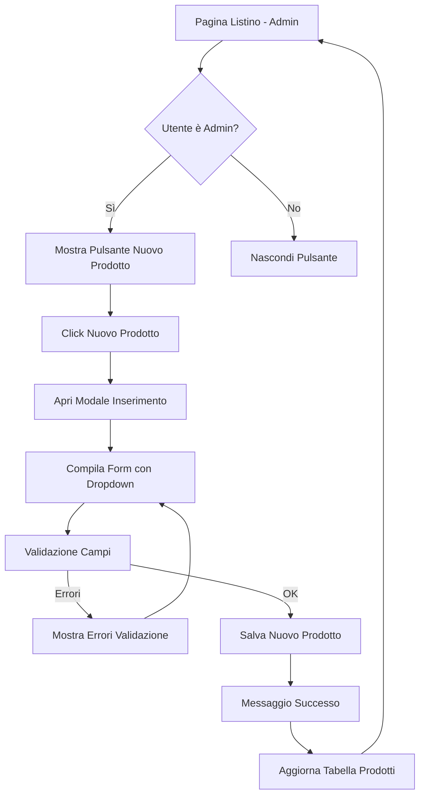

# Requisiti Funzionalità "Nuovo Prodotto" - Modalità Admin

## 1. Panoramica del Prodotto

Implementazione di una funzionalità per l'inserimento di nuovi prodotti nel sistema GAR, accessibile esclusivamente agli utenti con ruolo Admin. La funzionalità permetterà l'inserimento completo di tutti i campi della tabella products attraverso un'interfaccia modale intuitiva e validata.

## 2. Funzionalità Principali

### 2.1 Ruoli Utente

| Ruolo           | Metodo di Accesso              | Permessi Principali                          |
| --------------- | ------------------------------ | -------------------------------------------- |
| Admin           | Autenticazione con ruolo admin | Può creare, modificare ed eliminare prodotti |
| Utente Standard | Autenticazione standard        | Solo visualizzazione e modifica limitata     |

### 2.2 Moduli Funzionali

La funzionalità "Nuovo Prodotto" consiste nelle seguenti pagine principali:

1. **Pagina Listino**: pulsante "Nuovo Prodotto" visibile solo in modalità Admin
2. **Modale Nuovo Prodotto**: form completo per l'inserimento di tutti i campi prodotto

### 2.3 Dettagli delle Pagine

| Nome Pagina           | Nome Modulo             | Descrizione Funzionalità                                                                                            |
| --------------------- | ----------------------- | ------------------------------------------------------------------------------------------------------------------- |
| Pagina Listino        | Pulsante Nuovo Prodotto | Visualizza pulsante "Nuovo Prodotto" solo per utenti Admin, posizionato nell'header della tabella prodotti          |
| Modale Nuovo Prodotto | Form Inserimento        | Contiene tutti i campi della tabella products con validazione, dropdown per campi specifici, pulsanti Salva/Annulla |
| Modale Nuovo Prodotto | Dropdown XDE40          | Selezione valori predefiniti per campo XDE40                                                                        |
| Modale Nuovo Prodotto | Dropdown XDE60          | Selezione valori predefiniti per campo XDE60                                                                        |
| Modale Nuovo Prodotto | Dropdown APDESI         | Selezione descrizioni prodotto predefinite                                                                          |
| Modale Nuovo Prodotto | Dropdown APPESF         | Selezione pesi/formati predefiniti                                                                                  |
| Modale Nuovo Prodotto | Dropdown APUNMI         | Selezione unità di misura predefinite                                                                               |
| Modale Nuovo Prodotto | Dropdown APLIB1         | Selezione categorie/classificazioni predefinite                                                                     |

## 3. Processo Principale

### Flusso Admin per Nuovo Prodotto:

1. L'Admin accede alla pagina Listino
2. Visualizza il pulsante "Nuovo Prodotto" (non visibile agli utenti standard)
3. Clicca sul pulsante per aprire il modale
4. Compila tutti i campi richiesti utilizzando i dropdown per i campi specifici
5. Il sistema valida i dati inseriti
6. L'Admin conferma il salvataggio
7. Il nuovo prodotto viene creato nel database
8. Il sistema mostra un messaggio di conferma
9. La tabella prodotti viene aggiornata con il nuovo elemento

## 4. Design dell'Interfaccia Utente

### 4.1 Stile di Design

* **Colori primari**: Blu (#3B82F6) per il pulsante principale, Verde (#10B981) per conferma

* **Stile pulsanti**: Arrotondati con ombra leggera, effetto hover

* **Font**: Inter, dimensioni 14px per form, 16px per titoli

* **Layout**: Modale centrato con overlay scuro, form a due colonne su desktop

* **Icone**: Plus icon per "Nuovo Prodotto", Check per salvataggio

### 4.2 Panoramica Design Pagine

| Nome Pagina           | Nome Modulo             | Elementi UI                                                                                      |
| --------------------- | ----------------------- | ------------------------------------------------------------------------------------------------ |
| Pagina Listino        | Pulsante Nuovo Prodotto | Pulsante blu con icona Plus, posizionato in alto a destra della tabella, visibile solo per Admin |
| Modale Nuovo Prodotto | Header Modale           | Titolo "Nuovo Prodotto", pulsante X per chiusura                                                 |
| Modale Nuovo Prodotto | Form Principale         | Layout a due colonne, campi input con label, dropdown personalizzati                             |
| Modale Nuovo Prodotto | Dropdown Campi          | Select stilizzati con ricerca, valori predefiniti caricati dinamicamente                         |
| Modale Nuovo Prodotto | Footer Modale           | Pulsanti "Annulla" (grigio) e "Salva Prodotto" (blu), allineati a destra                         |

### 4.3 Responsività

* **Desktop-first**: Layout ottimizzato per schermi grandi con form a due colonne

* **Mobile-adaptive**: Form a colonna singola su dispositivi mobili, pulsanti full-width

* **Touch-friendly**: Elementi interattivi con dimensioni minime 44px per touch

