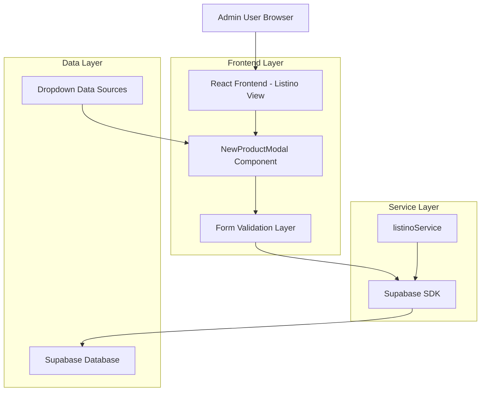
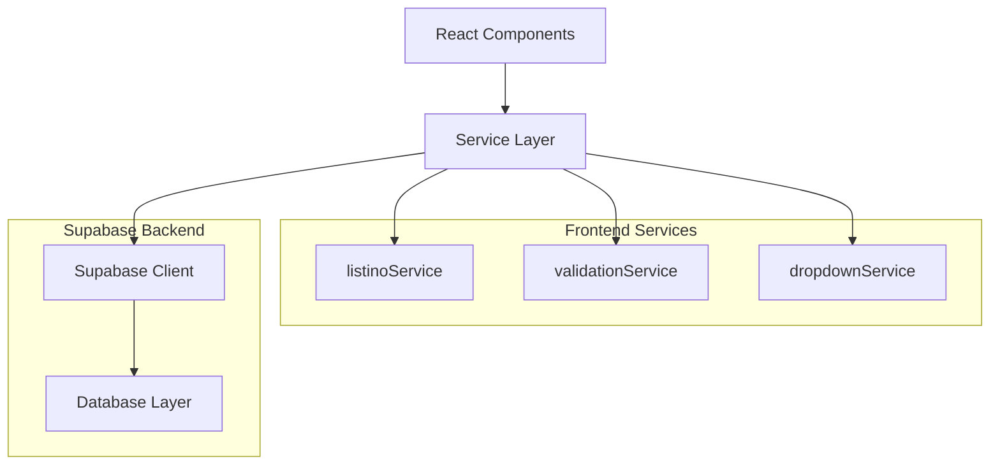
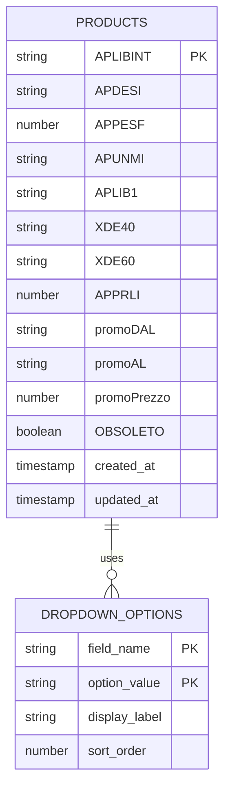

# Architettura Tecnica - Funzionalità "Nuovo Prodotto"

## 1. Design dell'Architettura



## 2. Descrizione Tecnologie
- Frontend: React@18 + TypeScript + TailwindCSS@3 + Vite
- Backend: Supabase (PostgreSQL + Auth + Real-time)
- Validazione: React Hook Form + Zod
- UI Components: Headless UI per dropdown e modal

## 3. Definizioni delle Route
| Route | Scopo |
|-------|-------|
| /listino | Pagina principale del listino con pulsante "Nuovo Prodotto" per Admin |
| /listino (modal) | Modale overlay per inserimento nuovo prodotto |

## 4. Definizioni API

### 4.1 API Principali

**Creazione nuovo prodotto**
```
POST /api/products (via Supabase)
```

Request:
| Nome Parametro | Tipo Parametro | Richiesto | Descrizione |
|----------------|----------------|-----------|-------------|
| APLIBINT | string | true | Codice interno prodotto (univoco) |
| APDESI | string | true | Descrizione prodotto |
| APPESF | number | false | Peso/formato prodotto |
| APUNMI | string | false | Unità di misura |
| APLIB1 | string | false | Categoria/classificazione |
| XDE40 | string | false | Campo specifico XDE40 |
| XDE60 | string | false | Campo specifico XDE60 |
| APPRLI | number | false | Prezzo listino |
| promoDAL | string | false | Data inizio promozione (formato: DD/MM/YYYY) |
| promoAL | string | false | Data fine promozione (formato: DD/MM/YYYY) |
| promoPrezzo | number | false | Prezzo promozionale |
| OBSOLETO | boolean | false | Flag prodotto obsoleto (default: false) |

Response:
| Nome Parametro | Tipo Parametro | Descrizione |
|----------------|----------------|-------------|
| success | boolean | Stato dell'operazione |
| data | object | Dati del prodotto creato |
| error | string | Messaggio di errore (se presente) |

Esempio Request:
```json
{
  "APLIBINT": "PROD001",
  "APDESI": "Prodotto di esempio",
  "APPESF": 1.5,
  "APUNMI": "KG",
  "APLIB1": "CATEGORIA_A",
  "XDE40": "VALORE_XDE40",
  "XDE60": "VALORE_XDE60",
  "APPRLI": 29.99,
  "promoDAL": "01/01/2024",
  "promoAL": "31/12/2024",
  "promoPrezzo": 24.99,
  "OBSOLETO": false
}
```

**Recupero opzioni dropdown**
```
GET /api/dropdown-options (via Supabase Views/Functions)
```

Response:
```json
{
  "XDE40": ["OPZIONE1", "OPZIONE2", "OPZIONE3"],
  "XDE60": ["VALORE1", "VALORE2", "VALORE3"],
  "APDESI": ["DESC1", "DESC2", "DESC3"],
  "APPESF": [0.5, 1.0, 1.5, 2.0],
  "APUNMI": ["KG", "LT", "PZ", "MT"],
  "APLIB1": ["CAT_A", "CAT_B", "CAT_C"]
}
```

## 5. Architettura Server



## 6. Modello Dati

### 6.1 Definizione Modello Dati



### 6.2 Linguaggio di Definizione Dati

**Tabella Products (esistente - da estendere se necessario)**
```sql
-- Verifica struttura tabella esistente
SELECT column_name, data_type, is_nullable 
FROM information_schema.columns 
WHERE table_name = 'products';

-- Aggiunta indici per performance (se non esistenti)
CREATE INDEX IF NOT EXISTS idx_products_aplibint ON products(APLIBINT);
CREATE INDEX IF NOT EXISTS idx_products_obsoleto ON products(OBSOLETO);
CREATE INDEX IF NOT EXISTS idx_products_created_at ON products(created_at DESC);
```

**Tabella Opzioni Dropdown (nuova)**
```sql
-- Creazione tabella per opzioni dropdown
CREATE TABLE IF NOT EXISTS dropdown_options (
    id UUID PRIMARY KEY DEFAULT gen_random_uuid(),
    field_name VARCHAR(50) NOT NULL,
    option_value VARCHAR(255) NOT NULL,
    display_label VARCHAR(255) NOT NULL,
    sort_order INTEGER DEFAULT 0,
    is_active BOOLEAN DEFAULT true,
    created_at TIMESTAMP WITH TIME ZONE DEFAULT NOW(),
    updated_at TIMESTAMP WITH TIME ZONE DEFAULT NOW(),
    UNIQUE(field_name, option_value)
);

-- Creazione indici
CREATE INDEX idx_dropdown_field_name ON dropdown_options(field_name);
CREATE INDEX idx_dropdown_active ON dropdown_options(is_active);
CREATE INDEX idx_dropdown_sort ON dropdown_options(field_name, sort_order);

-- Dati iniziali per dropdown
INSERT INTO dropdown_options (field_name, option_value, display_label, sort_order) VALUES
-- XDE40 options
('XDE40', 'OPT1', 'Opzione 1', 1),
('XDE40', 'OPT2', 'Opzione 2', 2),
('XDE40', 'OPT3', 'Opzione 3', 3),

-- XDE60 options
('XDE60', 'VAL1', 'Valore 1', 1),
('XDE60', 'VAL2', 'Valore 2', 2),
('XDE60', 'VAL3', 'Valore 3', 3),

-- APDESI options (descrizioni comuni)
('APDESI', 'DESC_STANDARD', 'Descrizione Standard', 1),
('APDESI', 'DESC_PREMIUM', 'Descrizione Premium', 2),
('APDESI', 'DESC_BASIC', 'Descrizione Basic', 3),

-- APPESF options (pesi/formati)
('APPESF', '0.5', '0.5 KG', 1),
('APPESF', '1.0', '1.0 KG', 2),
('APPESF', '1.5', '1.5 KG', 3),
('APPESF', '2.0', '2.0 KG', 4),

-- APUNMI options (unità di misura)
('APUNMI', 'KG', 'Chilogrammi', 1),
('APUNMI', 'LT', 'Litri', 2),
('APUNMI', 'PZ', 'Pezzi', 3),
('APUNMI', 'MT', 'Metri', 4),

-- APLIB1 options (categorie)
('APLIB1', 'CAT_A', 'Categoria A', 1),
('APLIB1', 'CAT_B', 'Categoria B', 2),
('APLIB1', 'CAT_C', 'Categoria C', 3);

-- Politiche RLS per Supabase
ALTER TABLE dropdown_options ENABLE ROW LEVEL SECURITY;

-- Permessi lettura per utenti autenticati
CREATE POLICY "Allow read dropdown_options for authenticated users" ON dropdown_options
    FOR SELECT USING (auth.role() = 'authenticated');

-- Permessi scrittura solo per admin
CREATE POLICY "Allow write dropdown_options for admin users" ON dropdown_options
    FOR ALL USING (
        auth.jwt() ->> 'role' = 'admin' OR 
        auth.jwt() ->> 'user_role' = 'admin'
    );
```

**Funzione per recupero opzioni dropdown**
```sql
-- Funzione per recuperare opzioni dropdown raggruppate
CREATE OR REPLACE FUNCTION get_dropdown_options()
RETURNS JSON AS $$
DECLARE
    result JSON;
BEGIN
    SELECT json_object_agg(
        field_name,
        options
    ) INTO result
    FROM (
        SELECT 
            field_name,
            json_agg(
                json_build_object(
                    'value', option_value,
                    'label', display_label
                ) ORDER BY sort_order
            ) as options
        FROM dropdown_options
        WHERE is_active = true
        GROUP BY field_name
    ) grouped_options;
    
    RETURN result;
END;
$$ LANGUAGE plpgsql SECURITY DEFINER;

-- Permessi per la funzione
GRANT EXECUTE ON FUNCTION get_dropdown_options() TO authenticated;
```