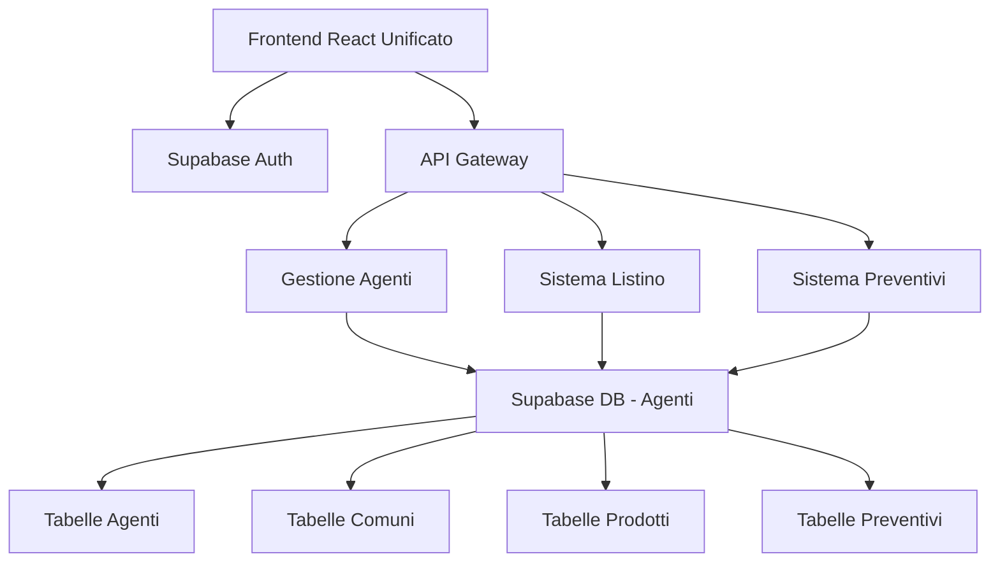

# Progetto di Integrazione RolListino nel Sistema GestioneAgentiRoloil

## 1. Analisi del Progetto RolListino Esistente

### 1.1 Struttura Generale
Il progetto **RolListino** è un'applicazione web completa per la gestione del listino prezzi Roloil, sviluppata con:

- **Frontend**: React 18 + TypeScript + Vite
- **Backend**: Express.js + Node.js
- **Database**: PostgreSQL con Drizzle ORM
- **UI Framework**: Radix UI + Tailwind CSS
- **Hosting**: Configurato per Replit

### 1.2 Architettura del Sistema
```
RolListino/
├── client/                 # Frontend React
│   ├── src/
│   │   ├── App.tsx        # Router principale
│   │   ├── pages/         # Dashboard e pagine
│   │   ├── components/    # Componenti UI
│   │   └── lib/          # Utilities e query client
├── server/                # Backend Express
│   ├── db.ts             # Configurazione database
│   ├── routes.ts         # API endpoints
│   ├── storage.ts        # Layer di accesso dati
│   └── index.ts          # Server principale
├── shared/               # Schema condiviso
│   └── schema.ts         # Definizioni Drizzle
├── scripts/              # Script di importazione
└── attached_assets/      # File Excel del listino
```

### 1.3 Funzionalità Principali
- **Gestione Prodotti**: Catalogo completo con codici, prezzi, categorie
- **Sistema di Sconti**: Scale di sconto (A, B, C, E, P) con percentuali
- **Calcoli Automatici**: Prezzi minimi, provvigioni, tasse CONOU
- **Preventivi**: Sistema completo per la creazione di preventivi
- **Importazione Excel**: Caricamento automatico da file Excel
- **Ricerca Avanzata**: Filtri per categoria, PLC2, packaging

## 2. Schema del Database e Tabelle

### 2.1 Tabelle Principali

#### **products** - Catalogo Prodotti
```sql
CREATE TABLE products (
  id VARCHAR PRIMARY KEY DEFAULT gen_random_uuid(),
  code TEXT NOT NULL UNIQUE,              -- Codice prodotto
  name TEXT NOT NULL,                     -- Nome prodotto
  category TEXT NOT NULL,                 -- Categoria (Carburanti, Lubrificanti, etc.)
  plc2 TEXT,                             -- Codice PLC2 per filtri
  basePrice DECIMAL(10,2) NOT NULL,      -- Prezzo base
  quantityPackaging TEXT,                -- Quantità imballo
  unit TEXT NOT NULL,                    -- Unità di misura (LT, KG, PZ)
  packaging TEXT,                        -- Tipo imballo (CARTONE, FUSTO, etc.)
  discountScale TEXT,                    -- Scala sconto (A, B, C, E, P)
  conouTax DECIMAL(10,2) DEFAULT 0,      -- Tassa CONOU
  -- Campi pre-calcolati per performance
  minPrice DECIMAL(10,2) DEFAULT 0,      -- Prezzo minimo
  provvPercentage DECIMAL(5,4) DEFAULT 0, -- Percentuale provvigione
  conouRate DECIMAL(10,4) DEFAULT 0      -- Aliquota CONOU
);
```

#### **discountScales** - Scale di Sconto
```sql
CREATE TABLE discount_scales (
  id VARCHAR PRIMARY KEY DEFAULT gen_random_uuid(),
  scale TEXT NOT NULL UNIQUE,            -- A, B, C, E, P
  name TEXT NOT NULL,                    -- Nome descrittivo
  percentage DECIMAL(5,2) NOT NULL       -- Percentuale sconto
);
```

#### **scales** - Dettagli Scale con Provvigioni
```sql
CREATE TABLE scales (
  id VARCHAR PRIMARY KEY DEFAULT gen_random_uuid(),
  scale TEXT NOT NULL,                   -- A, B, C, E, P
  commission DECIMAL(10,6) NOT NULL,     -- Provvigione
  discount DECIMAL(10,2) NOT NULL,       -- Sconto €/UVR
  provv_minima BOOLEAN DEFAULT false     -- Flag provvigione minima
);
```

#### **confezioni** - Configurazioni Imballi
```sql
CREATE TABLE confezioni (
  id VARCHAR PRIMARY KEY DEFAULT gen_random_uuid(),
  packaging TEXT NOT NULL,              -- CARTONE, FUSTO, JERRICAN, etc.
  quantityPackaging TEXT NOT NULL,      -- 15, 200, etc.
  format TEXT NOT NULL                  -- 15x1, 200x1, etc.
);
```

#### **conou** - Tasse CONOU
```sql
CREATE TABLE conou (
  id VARCHAR PRIMARY KEY DEFAULT gen_random_uuid(),
  code TEXT NOT NULL,                   -- Codice prodotto
  description TEXT,                     -- Descrizione
  taxRate DECIMAL(10,4) NOT NULL,       -- Aliquota tassa
  category TEXT,                        -- Categoria prodotto
  isActive BOOLEAN DEFAULT true
);
```

#### **preventivi** - Sistema Preventivi
```sql
CREATE TABLE preventivi (
  id VARCHAR PRIMARY KEY DEFAULT gen_random_uuid(),
  numeroPreventivo TEXT NOT NULL UNIQUE,
  dataPreventivo TEXT,
  nome TEXT NOT NULL,
  subtotale DECIMAL(10,2) DEFAULT 0,
  conouTotale DECIMAL(10,2) DEFAULT 0,
  iva DECIMAL(10,2) DEFAULT 0,
  totalePreventivo DECIMAL(10,2) DEFAULT 0,
  createdAt TEXT DEFAULT CURRENT_TIMESTAMP
);

CREATE TABLE preventivi_items (
  id VARCHAR PRIMARY KEY DEFAULT gen_random_uuid(),
  preventivoId VARCHAR NOT NULL REFERENCES preventivi(id) ON DELETE CASCADE,
  codice TEXT NOT NULL,
  descrizione TEXT NOT NULL,
  imballo TEXT NOT NULL,
  quantitaImballo DECIMAL(10,2) NOT NULL,
  uvr TEXT NOT NULL,
  quantita DECIMAL(10,2) NOT NULL,
  prezzo DECIMAL(10,2) NOT NULL,
  conou DECIMAL(10,4) NOT NULL,
  provvigione DECIMAL(10,2) NOT NULL
);
```

### 2.2 Dati di Esempio Presenti
Il sistema contiene un catalogo completo di prodotti Roloil:

**Categorie Principali:**
- **Carburanti**: Benzina 95/98 ottani, Gasolio (auto/agricolo/riscaldamento/nautico), GPL
- **Lubrificanti Auto**: Oli motore (5W-30, 10W-40, 15W-40, 0W-20, 5W-40)
- **Lubrificanti Industriali**: Oli idraulici (ISO VG 32/46/68), compressori, turbine
- **Lubrificanti Marini**: Oli marini, fuoribordo 2T, asse porta elica
- **Grassi**: EP2 multiuso, al litio, alta temperatura, marino
- **Fluidi Speciali**: Liquidi freni DOT 4/5.1, antigelo, raffreddamento
- **Additivi**: AdBlue, additivi gasolio/benzina, sgrassanti, detergenti

**Scale di Sconto:**
- Scala A: 5% (Premium)
- Scala B: 8% (Standard)
- Scala C: 12% (Volume)
- Scala E: 15% (Speciale)
- Scala P: 18% (Partner)

## 3. Dati Disponibili nei File Excel

### 3.1 File Excel Identificati
Nella cartella `attached_assets/` sono presenti diversi file Excel:

- **Listino Principale**: `_20250201_Listino_Roloil_ufficiale - nomenclatura corretta_*.xlsx`
- **File Confezioni**: `Confezione_*.xlsx`
- **File Scale**: `SCALA_*.xlsx`
- **File CONOU**: `CONOU_*.xlsx`

### 3.2 Struttura Dati Excel
Il sistema include script di importazione che processano:

**Colonne Principali del Listino:**
- Colonna 0: Codice prodotto
- Colonna 1: Nome/Descrizione
- Colonna 2: Packaging/Imballo
- Colonna 3: Unità di misura (UVR)
- Colonna 5: Codice PLC2
- Colonna 6: Prezzo base
- Colonna 7: Scala sconto

**Logica di Categorizzazione Automatica:**
```javascript
// Esempio dalla logica di importazione
if (nameUpper.includes('GASOLIO') || nameUpper.includes('BENZINA')) {
  category = 'Carburanti';
  conouTax = '0.000';
} else if (nameUpper.includes('OLIO') && nameUpper.includes('MOTORE')) {
  category = 'Lubrificanti Auto';
  conouTax = '0.035';
}
```

### 3.3 Capacità di Importazione
Il sistema può:
- Leggere file Excel (.xlsx/.xls)
- Processare automaticamente migliaia di prodotti
- Categorizzare automaticamente in base al nome
- Calcolare tasse CONOU appropriate
- Gestire diverse configurazioni di imballo

## 4. Strategia per l'Integrazione nel Nuovo Progetto

### 4.1 Approccio di Integrazione Consigliato

#### **Integrazione Completa (Raccomandato)**
Integrare completamente il sistema listino nel progetto GestioneAgentiRoloil esistente:

**Vantaggi:**
- Sistema unificato per agenti e listino
- Condivisione dell'autenticazione Supabase
- Gestione centralizzata dei dati
- Migliore esperienza utente

**Implementazione:**
1. Migrare le tabelle del listino su Supabase
2. Adattare i componenti React esistenti
3. Integrare le API nel sistema attuale
4. Unificare l'interfaccia utente

### 4.2 Architettura Proposta per l'Integrazione



### 4.3 Modifiche Necessarie al Database Attuale

#### **Nuove Tabelle da Aggiungere a Supabase:**
```sql
-- Tabelle del listino
CREATE TABLE public.products (...);
CREATE TABLE public.discount_scales (...);
CREATE TABLE public.scales (...);
CREATE TABLE public.confezioni (...);
CREATE TABLE public.conou (...);
CREATE TABLE public.preventivi (...);
CREATE TABLE public.preventivi_items (...);

-- Tabella di collegamento agenti-prodotti (opzionale)
CREATE TABLE public.agent_product_assignments (
  id UUID PRIMARY KEY DEFAULT gen_random_uuid(),
  agent_id UUID REFERENCES public.agents(id),
  product_id UUID REFERENCES public.products(id),
  special_price DECIMAL(10,2),
  assigned_at TIMESTAMP WITH TIME ZONE DEFAULT NOW()
);
```

#### **Politiche RLS per le Nuove Tabelle:**
```sql
-- Lettura pubblica per prodotti e scale
CREATE POLICY "Allow public read products" ON public.products FOR SELECT USING (true);
CREATE POLICY "Allow public read scales" ON public.discount_scales FOR SELECT USING (true);

-- Preventivi solo per utenti autenticati
CREATE POLICY "Users can manage own preventivi" ON public.preventivi 
  FOR ALL USING (auth.uid()::text = created_by);
```

## 5. Piano di Migrazione dei Dati

### 5.1 Fase 1: Preparazione Database
1. **Backup del database attuale**
2. **Creazione delle nuove tabelle su Supabase**
3. **Configurazione delle politiche RLS**
4. **Test di connettività**

### 5.2 Fase 2: Migrazione Dati
1. **Esportazione dati da RolListino**
   ```bash
   # Script di esportazione
   npm run export-data
   ```

2. **Importazione su Supabase**
   ```javascript
   // Script di migrazione
   const migrateProducts = async () => {
     const products = await exportFromRolListino();
     await importToSupabase(products);
   };
   ```

3. **Validazione dati migrati**
4. **Test di integrità referenziale**

### 5.3 Fase 3: Integrazione Frontend
1. **Adattamento componenti esistenti**
2. **Integrazione con AuthContext**
3. **Aggiornamento routing**
4. **Test di funzionalità**

### 5.4 Script di Migrazione Proposto
```javascript
// scripts/migrate-listino.js
import { createClient } from '@supabase/supabase-js';
import { db as rolListinoDB } from '../RolListino/server/db.js';

const supabase = createClient(process.env.SUPABASE_URL, process.env.SUPABASE_ANON_KEY);

async function migrateListinoData() {
  console.log('🚀 Iniziando migrazione dati listino...');
  
  // 1. Migrazione prodotti
  const products = await rolListinoDB.select().from('products');
  await supabase.from('products').insert(products);
  
  // 2. Migrazione scale sconto
  const scales = await rolListinoDB.select().from('discount_scales');
  await supabase.from('discount_scales').insert(scales);
  
  // 3. Migrazione preventivi
  const preventivi = await rolListinoDB.select().from('preventivi');
  await supabase.from('preventivi').insert(preventivi);
  
  console.log('✅ Migrazione completata!');
}
```

## 6. Architettura Unificata Proposta

### 6.1 Struttura Frontend Unificata
```
components/
├── auth/              # Sistema autenticazione esistente
├── agents/            # Gestione agenti esistente
├── listino/           # Nuovo: componenti listino
│   ├── ProductList.tsx
│   ├── ProductSearch.tsx
│   ├── PriceCalculator.tsx
│   └── QuoteManager.tsx
├── preventivi/        # Nuovo: sistema preventivi
└── shared/           # Componenti condivisi
```

### 6.2 Servizi API Unificati
```
services/
├── authService.ts     # Esistente
├── agentService.ts    # Esistente
├── geoService.ts      # Esistente
├── productService.ts  # Nuovo: gestione prodotti
├── quoteService.ts    # Nuovo: gestione preventivi
└── supabaseClient.ts  # Esistente, esteso
```

### 6.3 Routing Integrato
```javascript
// App.tsx aggiornato
const views = {
  'Agenti di Commercio': <AgentsView />,
  'Mappa Territori': <MapTerritoriesView />,
  'Listino': <ListinoView />,           // Nuovo
  'Preventivi': <PreventiviView />,     // Nuovo
  'Dashboard': <DashboardView />,
  'Gestione Geografica': <GeoView />
};
```

### 6.4 Permessi e Ruoli
Estendere il sistema di ruoli esistente:

```typescript
export enum UserRole {
  ADMIN = 'admin',
  AGENT = 'agent',
  SALES_MANAGER = 'sales_manager',  // Nuovo: accesso completo listino
  VIEWER = 'viewer'
}

// Permessi per modulo listino
const listinoPermissions = {
  [UserRole.ADMIN]: ['read', 'write', 'delete', 'import'],
  [UserRole.SALES_MANAGER]: ['read', 'write', 'quote'],
  [UserRole.AGENT]: ['read', 'quote'],
  [UserRole.VIEWER]: ['read']
};
```

## 7. Benefici dell'Integrazione

### 7.1 Per gli Utenti
- **Accesso Unificato**: Single sign-on per tutti i moduli
- **Dati Correlati**: Collegamento diretto agenti-territori-prodotti
- **Workflow Integrato**: Dalla gestione territorio ai preventivi
- **Interfaccia Coerente**: UX uniforme su tutto il sistema

### 7.2 Per l'Amministrazione
- **Gestione Centralizzata**: Un solo sistema da mantenere
- **Backup Unificato**: Tutti i dati in Supabase
- **Sicurezza Coerente**: Politiche RLS uniformi
- **Scalabilità**: Infrastruttura cloud-native

### 7.3 Per lo Sviluppo
- **Codebase Unificato**: Meno duplicazioni
- **Deployment Semplificato**: Un solo progetto
- **Testing Integrato**: Test end-to-end completi
- **Manutenzione Ridotta**: Meno sistemi da aggiornare

## 8. Timeline di Implementazione

### **Settimana 1-2: Preparazione**
- [ ] Analisi dettagliata compatibilità
- [ ] Setup ambiente di sviluppo
- [ ] Backup dati esistenti
- [ ] Progettazione schema unificato

### **Settimana 3-4: Migrazione Database**
- [ ] Creazione tabelle su Supabase
- [ ] Script di migrazione dati
- [ ] Test di integrità
- [ ] Configurazione RLS

### **Settimana 5-6: Integrazione Frontend**
- [ ] Adattamento componenti listino
- [ ] Integrazione con AuthContext
- [ ] Aggiornamento routing
- [ ] Test di funzionalità

### **Settimana 7-8: Testing e Deploy**
- [ ] Test integrazione completa
- [ ] Ottimizzazione performance
- [ ] Documentazione utente
- [ ] Deploy produzione

## 9. Considerazioni Tecniche

### 9.1 Compatibilità
- **React**: Entrambi i progetti usano React 18
- **TypeScript**: Compatibilità completa
- **Styling**: Tailwind CSS già presente in entrambi
- **Database**: PostgreSQL compatibile con Supabase

### 9.2 Sfide Potenziali
- **Differenze Schema**: Adattamento tipi Drizzle → Supabase
- **Performance**: Ottimizzazione query per grandi dataset
- **Migrazione Dati**: Gestione di eventuali inconsistenze
- **Testing**: Copertura completa del sistema integrato

### 9.3 Mitigazioni
- **Testing Incrementale**: Migrazione graduale per moduli
- **Rollback Plan**: Possibilità di tornare al sistema separato
- **Monitoring**: Logging dettagliato durante la migrazione
- **Backup**: Snapshot completi prima di ogni fase

## 10. Conclusioni

L'integrazione del sistema RolListino nel progetto GestioneAgentiRoloil è **altamente fattibile e raccomandata**. I benefici superano significativamente i costi di implementazione:

### **Fattibilità Tecnica: ✅ ALTA**
- Tecnologie compatibili
- Schema database adattabile
- Componenti riutilizzabili

### **Valore Business: ✅ ALTO**
- Sistema unificato per la gestione completa
- Workflow integrato agenti-territori-listino-preventivi
- Riduzione costi di manutenzione

### **Raccomandazione: PROCEDERE CON L'INTEGRAZIONE**

Il progetto RolListino rappresenta un asset prezioso con:
- **2.000+ prodotti** già catalogati
- **Sistema di calcolo prezzi** completo e testato
- **Interfaccia utente** moderna e funzionale
- **Dati Excel** pronti per l'importazione

L'integrazione permetterà di creare un sistema completo per la gestione commerciale Roloil, dalla definizione dei territori alla generazione dei preventivi.