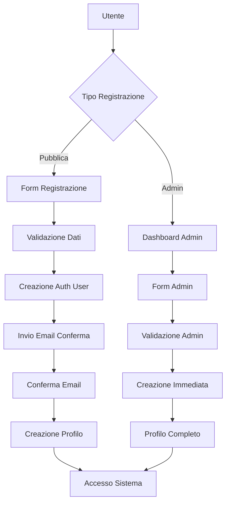

# 🔐 Sistema di Autenticazione e Gestione Utenti - Completo

## 1. Panoramica del Prodotto

Sistema completo di autenticazione e gestione utenti per l'applicazione GestioneAgentiRoloil che risolve definitivamente i problemi di "Database error saving new user" attraverso un'architettura robusta e sicura.

Il sistema gestisce tre tipologie di utenti (admin, agente, operatore) con flussi di registrazione sia pubblici che amministrativi, garantendo la creazione automatica dei profili e la gestione completa dei permessi attraverso Row Level Security (RLS).

## 2. Funzionalità Principali

### 2.1 Ruoli Utente

| Ruolo | Metodo di Registrazione | Permessi Principali |
|-------|------------------------|-------------------|
| Admin | Solo invito da altro admin | Gestione completa utenti, accesso a tutte le funzionalità |
| Agente | Registrazione pubblica o creazione admin | Gestione territori assegnati, visualizzazione dati |
| Operatore | Registrazione pubblica o creazione admin | Accesso base, visualizzazione limitata |

### 2.2 Moduli Funzionali

Il sistema di autenticazione comprende le seguenti pagine essenziali:

1. **Pagina di Login**: autenticazione utenti esistenti, recupero password
2. **Pagina di Registrazione Pubblica**: registrazione autonoma per agenti e operatori
3. **Dashboard Admin**: gestione utenti, creazione nuovi account, assegnazione ruoli
4. **Profilo Utente**: modifica dati personali, cambio password
5. **Gestione Permessi**: configurazione accessi per territorio e funzionalità

### 2.3 Dettagli delle Pagine

| Pagina | Modulo | Descrizione Funzionalità |
|--------|--------|-------------------------|
| Login | Form di autenticazione | Validazione credenziali, gestione sessioni, redirect basato su ruolo |
| Registrazione | Form registrazione pubblica | Validazione dati, creazione account, conferma email, assegnazione ruolo default |
| Dashboard Admin | Gestione utenti | Visualizzazione lista utenti, creazione nuovi account, modifica ruoli, attivazione/disattivazione |
| Profilo Utente | Gestione dati personali | Modifica informazioni personali, cambio password, gestione preferenze |
| Gestione Permessi | Configurazione accessi | Assegnazione territori, definizione permessi specifici, gestione RLS |

## 3. Flusso Operativo Principale

### Flusso Registrazione Pubblica
1. L'utente accede alla pagina di registrazione
2. Compila il form con dati personali (nome, email, password, telefono)
3. Seleziona il ruolo desiderato (agente o operatore)
4. Il sistema valida i dati e verifica unicità email/username
5. Viene creato l'account in auth.users con email_confirm=false
6. Viene inviata email di conferma
7. Al click di conferma, viene creato automaticamente il profilo in profiles
8. L'utente può accedere al sistema

### Flusso Creazione Admin
1. L'admin accede alla dashboard di gestione utenti
2. Clicca su "Aggiungi Nuovo Utente"
3. Compila il form con tutti i dati necessari
4. Seleziona il ruolo appropriato
5. Il sistema crea immediatamente l'account con email_confirm=true
6. Viene creato automaticamente il profilo completo
7. Viene inviata email con credenziali temporanee
8. L'utente può accedere immediatamente

## 4. Design dell'Interfaccia Utente

### 4.1 Stile di Design

- **Colori Primari**: #2563EB (blu principale), #DC2626 (rosso admin), #059669 (verde operatore)
- **Colori Secondari**: #6B7280 (grigio neutro), #F3F4F6 (sfondo chiaro)
- **Stile Pulsanti**: Arrotondati con ombra leggera, hover con transizione smooth
- **Font**: Inter o system font, dimensioni 14px-16px per testo normale, 18px-24px per titoli
- **Layout**: Card-based con spaziatura generosa, navigazione top-bar responsive
- **Icone**: Heroicons o Lucide React per coerenza visiva

### 4.2 Panoramica Design delle Pagine

| Pagina | Modulo | Elementi UI |
|--------|--------|-------------|
| Login | Form centrale | Card centrata, campi email/password, pulsante login blu, link "Registrati", recupero password |
| Registrazione | Form multi-step | Wizard a 3 step, validazione real-time, indicatori progresso, pulsanti next/back |
| Dashboard Admin | Tabella utenti | Header con filtri, tabella responsive, azioni inline, modal per creazione, badge ruoli colorati |
| Profilo Utente | Form dati personali | Layout a due colonne, avatar upload, sezioni collapsibili, pulsanti salva/annulla |
| Gestione Permessi | Interfaccia permessi | Tree view per territori, toggle switches per permessi, preview modifiche |

### 4.3 Responsività

Il sistema è progettato mobile-first con breakpoint responsive:
- Mobile: 320px-768px (layout single-column, menu hamburger)
- Tablet: 768px-1024px (layout adattivo, sidebar collassabile)
- Desktop: 1024px+ (layout completo, sidebar fissa)
- Touch optimization per dispositivi mobili con target touch di almeno 44px